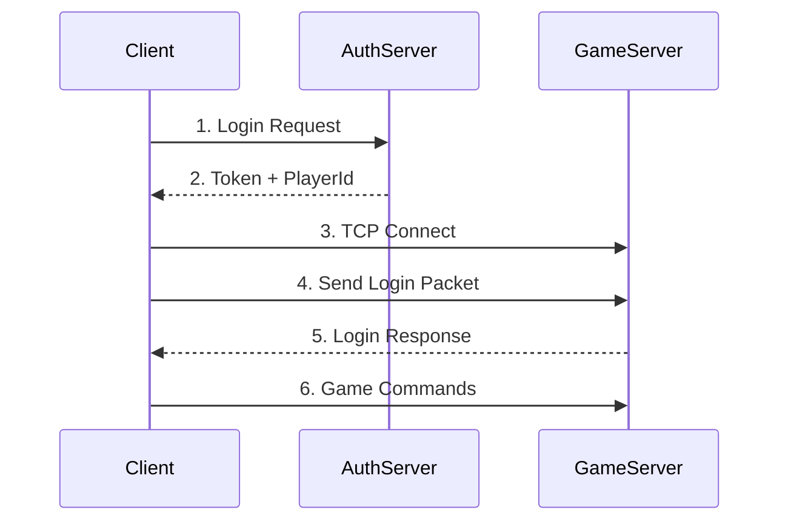

# 📡 API 및 프로토콜 명세서

## 📌 개요

이 문서는 게임 서버의 모든 API 엔드포인트와 패킷 프로토콜을 정의합니다. 클라이언트 개발자가 서버와 통신하는 방법을 쉽게 이해할 수 있도록 작성되었습니다.

## 🔗 서버 연결 정보

| 서버 | 용도 | 프로토콜 | 포트 | 환경 |
|------|------|---------|------|------|
| **AuthServer** | 인증/로그인 | HTTP/HTTPS | 5006 | Production |
| **ActorServer** | 게임 플레이 | TCP Socket | 9999 | Production |
| **AuthServer** | 인증/로그인 | HTTPS | 7020 | Development |

## 🔐 인증 서버 API (AuthServer)

### Base URL
```
Production: http://localhost:5006/api
Docker: http://authserver:5006/api
```

### 1. 로그인 API

#### `POST /auth/login`

플레이어 로그인 및 토큰 발급

**Request:**
```http
POST /api/auth/login
Content-Type: application/json

{
    "accountId": "player_name_123"
}
```

**Request Fields:**
| 필드 | 타입 | 필수 | 설명 | 제약사항 |
|------|------|------|------|----------|
| `accountId` | string | ✅ | 계정 ID | 영문, 숫자, 언더스코어(_)만 허용 |

**Response - Success (200 OK):**
```json
{
    "success": true,
    "message": "Login successful",
    "playerId": 1001,
    "token": "eyJhbGciOiJIUzI1NiIs...",
    "isNewAccount": false,
    "lastLoginAt": "2024-01-20T10:30:00Z"
}
```

**Response - Error (400 Bad Request):**
```json
{
    "success": false,
    "message": "AccountId can only contain letters, numbers, and underscores",
    "playerId": 0,
    "token": null
}
```

**Response Fields:**
| 필드 | 타입 | 설명 |
|------|------|------|
| `success` | boolean | 로그인 성공 여부 |
| `message` | string | 결과 메시지 |
| `playerId` | long | 플레이어 고유 ID (1000번부터 시작) |
| `token` | string | JWT 인증 토큰 (24시간 유효) |
| `isNewAccount` | boolean | 신규 계정 여부 |
| `lastLoginAt` | datetime? | 이전 로그인 시간 |

**사용 예제 (C#):**
```csharp
using var client = new HttpClient();
var request = new LoginRequest { AccountId = "test_player" };
var response = await client.PostAsJsonAsync("http://localhost:5006/api/auth/login", request);
var loginResult = await response.Content.ReadFromJsonAsync<LoginResponse>();

if (loginResult.Success)
{
    // 토큰 저장 및 게임 서버 연결
    ConnectToGameServer(loginResult.PlayerId, loginResult.Token);
}
```

### 2. 헬스 체크 API

#### `GET /auth/health`

서버 상태 확인

**Request:**
```http
GET /api/auth/health
```

**Response (200 OK):**
```json
{
    "status": "healthy",
    "timestamp": "2024-01-20T10:30:00Z"
}
```

## 🎮 게임 서버 프로토콜 (ActorServer)

### 연결 방식
- **프로토콜**: TCP Socket
- **포트**: 9999
- **인코딩**: UTF-8
- **패킷 형식**: JSON + 개행문자(\n)

### 연결 플로우



## 📦 패킷 프로토콜

### 패킷 구조

모든 패킷은 JSON 형식이며, 개행문자(\n)로 구분됩니다.

**기본 패킷 구조:**
```typescript
interface Packet {
    type: PacketType;        // 패킷 타입
    timestamp: number;       // Unix timestamp (ms)
    [key: string]: any;     // 추가 필드
}
```

### 1. Client → Server 패킷

#### 1.1 Login Packet
플레이어 인증 및 게임 진입

```json
{
    "type": "Login",
    "playerId": 1001,
    "token": "eyJhbGciOiJIUzI1NiIs...",
    "timestamp": 1699123456789
}
```

| 필드 | 타입 | 설명 |
|------|------|------|
| `type` | string | "Login" 고정 |
| `playerId` | long | AuthServer에서 받은 ID |
| `token` | string | AuthServer에서 받은 토큰 |

#### 1.2 Move Packet
플레이어 이동 요청

```json
{
    "type": "Move",
    "x": 100.5,
    "y": 200.5,
    "timestamp": 1699123456790
}
```

| 필드 | 타입 | 설명 | 제약 |
|------|------|------|------|
| `type` | string | "Move" 고정 | - |
| `x` | float | X 좌표 | -1000 ~ 1000 |
| `y` | float | Y 좌표 | -1000 ~ 1000 |

#### 1.3 Say Packet
채팅 메시지 전송

```json
{
    "type": "Say",
    "message": "Hello, World!",
    "timestamp": 1699123456791
}
```

| 필드 | 타입 | 설명 | 제약 |
|------|------|------|------|
| `type` | string | "Say" 고정 | - |
| `message` | string | 채팅 내용 | 최대 200자 |

#### 1.4 Zone Packet
Zone 변경 요청

```json
{
    "type": "Zone",
    "zoneId": 1,
    "timestamp": 1699123456792
}
```

| 필드 | 타입 | 설명 | 값 |
|------|------|------|-----|
| `type` | string | "Zone" 고정 | - |
| `zoneId` | int | Zone ID | 0: Town, 1: Forest |

### 2. Server → Client 패킷

#### 2.1 LoginResponse Packet
로그인 응답

```json
{
    "type": "LoginResponse",
    "success": true,
    "message": "Logged in as PlayerId: 1001",
    "playerId": 1001,
    "timestamp": 1699123456790
}
```

#### 2.2 MoveNotification Packet
이동 알림 (자신 또는 다른 플레이어)

```json
{
    "type": "MoveNotification",
    "playerId": 1001,
    "x": 100.5,
    "y": 200.5,
    "isSelf": true,
    "timestamp": 1699123456791
}
```

| 필드 | 타입 | 설명 |
|------|------|------|
| `playerId` | long | 이동한 플레이어 ID |
| `x`, `y` | float | 새 위치 |
| `isSelf` | boolean | 자신의 이동 여부 |

#### 2.3 ChatMessage Packet
채팅 메시지 브로드캐스트

```json
{
    "type": "ChatMessage",
    "playerName": "Player_1001",
    "message": "Hello, World!",
    "isSelf": false,
    "timestamp": 1699123456792
}
```

#### 2.4 ZoneChangeResponse Packet
Zone 변경 응답

```json
{
    "type": "ZoneChangeResponse",
    "success": true,
    "zoneName": "Forest",
    "message": "Entered Forest at (100, 100)",
    "timestamp": 1699123456793
}
```

#### 2.5 ErrorMessage Packet
에러 메시지

```json
{
    "type": "ErrorMessage",
    "error": "ZONE_CHANGE_ERROR",
    "details": "Zone is full (50/50 players)",
    "timestamp": 1699123456794
}
```

**에러 타입:**
| 에러 | 설명 |
|------|------|
| `ZONE_CHANGE_ERROR` | Zone 변경 실패 |
| `PLAYER_MOVE_ERROR` | 이동 실패 |
| `NOT_LOGGED_IN` | 미인증 상태 |
| `INVALID_PACKET` | 잘못된 패킷 형식 |

#### 2.6 ZoneInfo Packet
Zone 진입 시 정보

```json
{
    "type": "ZoneInfo",
    "zoneId": "Forest",
    "zoneName": "Dark Forest",
    "zoneType": "PvE",
    "spawnPoint": {
        "x": 100,
        "y": 100
    },
    "playerCount": 12,
    "timestamp": 1699123456795
}
```


## 🔍 디버깅 가이드

### 연결 테스트 (Telnet)
```bash
# 서버 연결 테스트
telnet localhost 9999

# 로그인 패킷 전송 (한 줄로 입력)
{"type":"Login","playerId":1001,"token":"test_token","timestamp":1699123456789}
```

### 연결 테스트 (Netcat)
```bash
# 서버 연결
nc localhost 9999

# 패킷 전송
echo '{"type":"Login","playerId":1001,"token":"test_token"}' | nc localhost 9999
```

### Postman으로 Auth API 테스트
```
1. New Request 생성
2. Method: POST
3. URL: http://localhost:5006/api/auth/login
4. Body: raw → JSON
5. Content:
{
    "accountId": "test_player"
}
```

## ⚠️ 주의사항

### 1. 패킷 크기 제한
- 단일 패킷 최대 크기: 64KB
- 채팅 메시지: 200자
- JSON 깊이: 최대 5단계

### 2. 연결 제한
- 동일 IP 최대 연결: 5개
- 연결 타임아웃: 30초
- 유휴 타임아웃: 5분

### 3. 인증 규칙
- 토큰 유효기간: 24시간
- 로그인 없이 명령 불가
- 토큰 갱신 필요 시 재로그인

### 4. Rate Limiting
| 액션 | 제한 |
|------|------|
| 로그인 시도 | 5회/분 |
| 이동 명령 | 10회/초 |
| 채팅 메시지 | 3회/초 |
| Zone 변경 | 1회/10초 |

## 📊 응답 코드

### HTTP Status Codes (AuthServer)
| 코드 | 의미 | 설명 |
|------|------|------|
| 200 | OK | 성공 |
| 400 | Bad Request | 잘못된 요청 |
| 401 | Unauthorized | 인증 실패 |
| 429 | Too Many Requests | 요청 제한 초과 |
| 500 | Internal Server Error | 서버 오류 |

### Game Error Codes (ActorServer)
| 코드 | 의미 | 처리 |
|------|------|------|
| 1001 | Invalid Token | 재로그인 필요 |
| 2001 | Zone Full | 다른 Zone 선택 |
| 2002 | Invalid Position | 위치 재조정 |
| 3001 | Chat Spam | 대기 후 재시도 |
