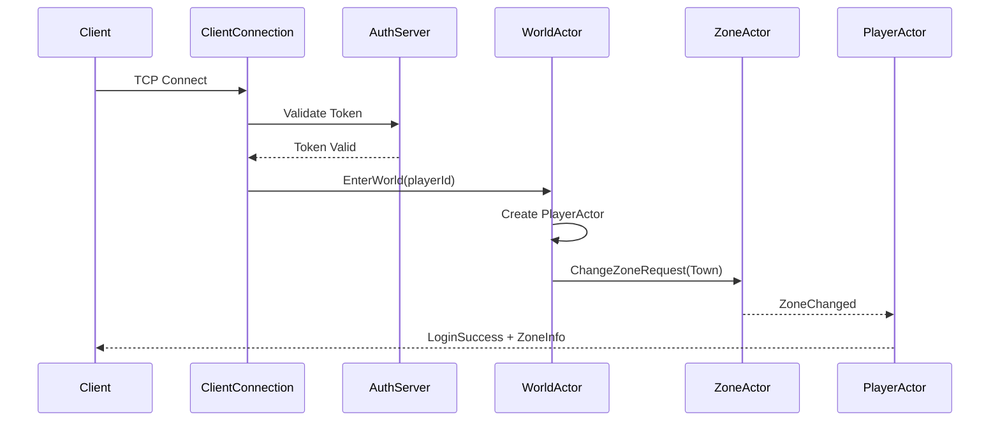
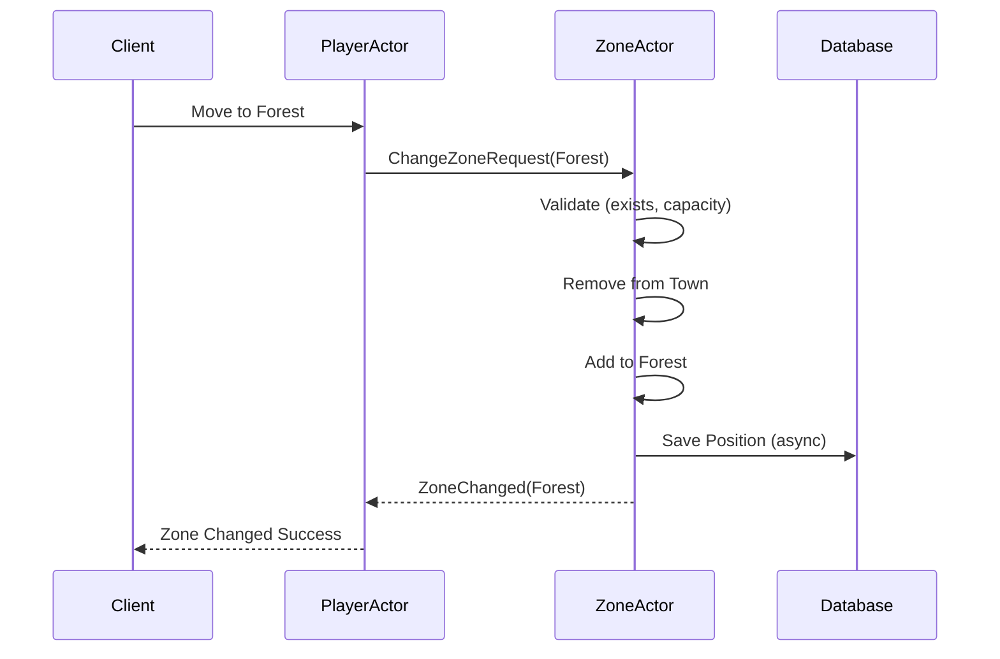

# 🏗️ 시스템 아키텍처 설계

## 📌 개요

이 문서는 Actor 기반 게임 서버의 전체적인 아키텍처를 설명합니다. Akka.NET의 Actor 모델을 활용하여 확장 가능하고 장애에 강한 시스템을 구축했습니다.

## 🎯 설계 원칙

### 1. Actor Model 채택 이유

**왜 Actor Model인가?**
- **자연스러운 게임 엔티티 매핑**: 플레이어, NPC, 아이템 등이 독립적인 Actor로 동작
- **동시성 처리**: 락(Lock) 없이 메시지 기반으로 안전한 동시성 처리
- **장애 격리**: 한 Actor의 실패가 전체 시스템에 영향을 주지 않음
- **확장성**: Location Transparency로 분산 환경 확장 용이

### 2. 마이크로서비스 분리

```
┌─────────────────────────────────────────────────────┐
│                   Client Layer                      │
│                  (TCP/WebSocket)                    │
└─────────────────────────────────────────────────────┘
                           │
        ┌──────────────────┴──────────────────┐
        ▼                                      ▼
┌──────────────────┐              ┌──────────────────┐
│   AuthServer     │              │   ActorServer    │
│   (Port 5006)    │◄────────────►│   (Port 9999)   │
└──────────────────┘              └──────────────────┘
        │                                      │
        └──────────────┬───────────────────────┘
                       ▼
              ┌──────────────────┐
              │    Database      │
              │    (SQLite)      │
              └──────────────────┘
```

**서비스 분리 이유**:
- **AuthServer**: 인증 전용, Stateless, 수평 확장 가능
- **ActorServer**: 게임 로직, Stateful, Actor 기반
- **독립 배포**: 각 서비스를 독립적으로 업데이트 가능

## 🔧 핵심 컴포넌트

### 1. AuthServer (인증 서버)

```csharp
// 인증 플로우
Client → LoginRequest → AuthServer
         ↓
    Token 검증/생성
         ↓
    AccountDatabase
         ↓
    LoginResponse ← AuthServer
         ↓
      Client
```

**주요 기능**:
- JWT 토큰 발급 및 검증
- 계정 자동 생성 (첫 로그인 시)
- PlayerId 할당 (1000번부터 시작)

**기술적 특징**:
```csharp
// Controllers/AuthController.cs
[HttpPost("login")]
public async Task<LoginResponse> Login(LoginRequest request)
{
    // 1. AccountId 검증 (영문, 숫자, _ 만 허용)
    // 2. DB에서 계정 조회 또는 생성
    // 3. 토큰 생성 (24시간 유효)
    // 4. 응답 반환
}
```

### 2. ActorServer (게임 서버)

#### 2.1 Actor Hierarchy (계층 구조)

```
ActorSystem
    │
    ├── /user
    │   ├── world (WorldActor)
    │   │   └── player-{id} (PlayerActor) [0..n]
    │   │
    │   ├── zone (ZoneActor)
    │   │   ├── town (ZoneInfo)
    │   │   └── forest (ZoneInfo)
    │   │
    │   └── tcp-server (TcpServerActor)
    │       └── client-{guid} (ClientConnectionActor) [0..n]
    │
    └── /system
        └── (Akka 시스템 Actor들)
```

#### 2.2 Actor 역할과 책임

##### **WorldActor** (세계 관리자)
```csharp
public class WorldActor : ReceiveActor
{
    private Dictionary<long, IActorRef> players = new();
    
    // 주요 책임:
    // 1. PlayerActor 생성/관리
    // 2. 전역 메시지 라우팅
    // 3. 플레이어 생명주기 관리
}
```

**메시지 처리**:
- `EnterWorld`: 새 플레이어 진입
- `ClientDisconnected`: 플레이어 연결 종료
- `PlayerMove`: 이동 명령 라우팅

##### **ZoneActor** (지역 관리자)
```csharp
public class ZoneActor : ReceiveActor
{
    private Dictionary<ZoneId, ZoneInfo> zones = new();
    
    // 주요 책임:
    // 1. Zone 간 이동 처리
    // 2. Zone 내 플레이어 관리
    // 3. 위치 정보 DB 저장
}
```

**Zone 이동 플로우**:
```
PlayerActor → ChangeZoneRequest → ZoneActor
                ↓
         Zone 검증 (존재, 수용량)
                ↓
         이전 Zone에서 제거
                ↓
         새 Zone에 추가
                ↓
         DB 저장 (비동기)
                ↓
    ZoneChanged ← ZoneActor → PlayerActor
```

##### **PlayerActor** (플레이어 개체)
```csharp
public class PlayerActor : ReceiveActor
{
    private readonly long playerId;
    private IActorRef? clientConnection;
    
    // 주요 책임:
    // 1. 플레이어 상태 관리
    // 2. 클라이언트 응답 전송
    // 3. 게임 로직 실행
}
```

### 3. Supervision Strategy (감독 전략)

```csharp
// Actor 장애 처리 전략
protected override SupervisorStrategy SupervisorStrategy()
{
    return new OneForOneStrategy(
        maxNrOfRetries: 10,
        withinTimeRange: TimeSpan.FromMinutes(1),
        localOnlyDecider: ex => ex switch
        {
            // 게임 로직 예외 → 재시작하지 않고 계속
            GameLogicException => Directive.Resume,
            
            // 일시적 오류 → 재시작
            TemporaryGameException => Directive.Restart,
            
            // 치명적 오류 → Actor 종료
            CriticalGameException => Directive.Stop,
            
            // 기타 → 상위로 전달
            _ => Directive.Escalate
        });
}
```

**장애 복구 시나리오**:

1. **Resume (재개)**: 메시지 처리 계속
   - 잘못된 입력, 검증 실패 등

2. **Restart (재시작)**: Actor 상태 초기화
   - 네트워크 일시 장애, DB 연결 오류 등

3. **Stop (종료)**: Actor 제거
   - 복구 불가능한 상태, 데이터 손상 등

## 📡 네트워크 아키텍처

### 1. 패킷 프로토콜

```json
// Client → Server
{
    "type": "Login",
    "playerId": 1001,
    "token": "eyJhbGc...",
    "timestamp": 1699123456789
}

// Server → Client
{
    "type": "LoginResponse",
    "success": true,
    "message": "Login successful",
    "playerId": 1001,
    "timestamp": 1699123456790
}
```

### 2. 연결 관리

```
Client → TCP Connect → TcpServerActor
            ↓
    ClientConnectionActor 생성
            ↓
    PacketHandler 등록
            ↓
    Login 패킷 처리
            ↓
    WorldActor 연결
```

**연결 생명주기**:
1. **연결**: TCP 소켓 연결 수립
2. **인증**: Token 검증
3. **게임 진입**: PlayerActor 생성
4. **플레이**: 메시지 교환
5. **종료**: 정리 및 자원 해제

## 💾 데이터 저장 전략

### 1. 데이터베이스 구조

```sql
-- accounts 테이블 (AuthServer)
CREATE TABLE accounts (
    player_id INTEGER PRIMARY KEY AUTOINCREMENT,
    account_id TEXT UNIQUE NOT NULL,
    created_at TEXT NOT NULL,
    last_login_at TEXT NOT NULL,
    token TEXT,
    token_expires_at TEXT
);

-- player_states 테이블 (ActorServer)
CREATE TABLE player_states (
    player_id INTEGER PRIMARY KEY,
    position_x REAL DEFAULT 0,
    position_y REAL DEFAULT 0,
    zone_id INTEGER DEFAULT 0,
    last_saved TEXT
);
```

### 2. 저장 시점

- **즉시 저장**: Zone 변경, 중요 아이템 획득
- **주기적 저장**: 30초마다 위치 정보
- **종료 시 저장**: 플레이어 disconnect

## 🔄 메시지 흐름 예제

### 로그인 및 게임 진입



### Zone 이동 처리



## 🚀 확장 전략

### 1. 수평 확장 (Scale-Out)

```
현재 (단일 서버):
    ActorServer (100 players)

확장 후 (Akka.Cluster):
    ActorServer-1 (Zone: Town)
    ActorServer-2 (Zone: Forest)
    ActorServer-3 (Zone: Dungeon)
```

### 2. 성능 최적화

**현재 병목점**:
- DB 동기 작업 → 비동기 배치 처리
- 단일 ZoneActor → Zone별 Actor 분리
- JSON 직렬화 → MessagePack/Protobuf

**개선 계획**:
```csharp
// 현재: 동기 DB 저장
_playerDb.SavePlayer(playerId, x, y, zoneId);

// 개선: 배치 저장
_batchSaver.QueueSave(new SaveRequest(playerId, x, y, zoneId));
// 100ms마다 또는 100개 쌓이면 배치 저장
```

## 🔍 모니터링 포인트

### 1. 핵심 메트릭

- **Actor 메트릭**:
  - 활성 Actor 수
  - 메시지 큐 길이
  - 처리 시간

- **시스템 메트릭**:
  - CPU/Memory 사용률
  - 네트워크 I/O
  - DB 쿼리 시간

### 2. 헬스체크

```csharp
// Health Check Endpoint
GET /api/health
{
    "status": "healthy",
    "actors": {
        "world": "running",
        "zone": "running",
        "players": 45
    },
    "database": "connected",
    "uptime": "2d 14h 32m"
}
```

## 📚 참고 자료

- [Akka.NET Documentation](https://getakka.net/)
- [Actor Model Theory](https://en.wikipedia.org/wiki/Actor_model)
- [Reactive Manifesto](https://www.reactivemanifesto.org/)
- [Domain-Driven Design](https://dddcommunity.org/)

## 🤔 설계 결정 Q&A

**Q: 왜 Akka.NET을 선택했나요?**
> A: .NET 생태계에서 가장 성숙한 Actor 프레임워크이며, Erlang/OTP의 검증된 패턴을 제공합니다.

**Q: 왜 SQLite를 사용하나요?**
> A: 포트폴리오 프로젝트로 단순성을 우선시했습니다. 프로덕션에서는 PostgreSQL/MongoDB로 교체 가능합니다.

**Q: 100명 이상 확장하려면?**
> A: Akka.Cluster를 도입하여 Actor를 여러 노드에 분산시키고, Redis 캐싱을 추가합니다.
